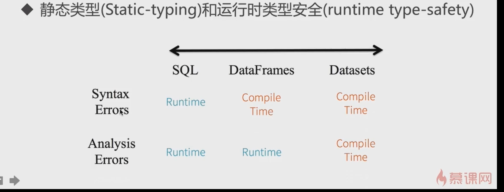

1. sql  df  ds  比较
   
   - sql  selec name from people  compile  ok,  result no
   - df   df.selectc("name")    compile  no,   df.select("namea")  compile  ok,
   - ds   ds.map(line -> line.namea)    compile  no,
   
      
      
2. 